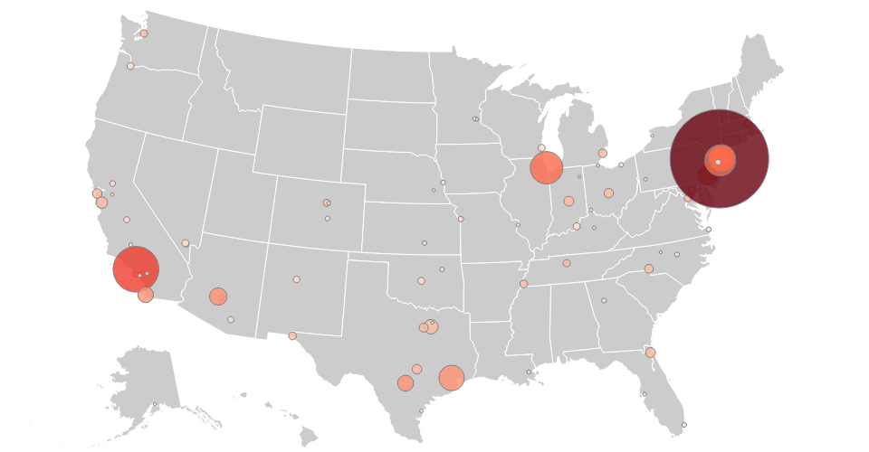

## Map of US States :earth_americas:

of geocoded circles with radius representing a datapoint



## Install
```bash
$ npm install d3node-map-us-states
```

## Usage

```js
const d3nMap = require('d3node-map-us-states')
// get CSV string
const geoCSV = fs.readFileSync('./locations.csv').toString()

// calculate size of circle
const radius = function (d) {
  return d.POP_2010 / 150000
}

const map = d3nMap({ geoCSV, radius })
map.svgString() // returns <svg>
```

See [test](./test/index.js) for actual usage.

##### Output the example map to an image
```
npm test
```

## API

#### Options `{ geoCSV, [radius, fill, styles] }`
